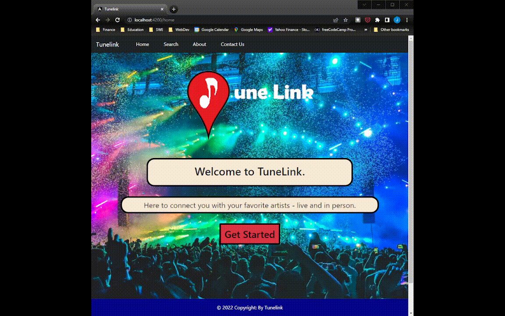

## Development Team

<ul>
    <li>Joe Moon :: jmn5y@umsystem.edu</li>
    <li>Nathan Cheney :: ncxn8@umsystem.edu</li>
    <li>Keenan Flynn :: kpfxn8@umsystem.edu</li>
    <li>Jasmine Naraine :: jnytc@umsystem.edu</li>
</ul>

## TuneLink Project Description

TuneLink is a web application that operates as a search engine for finding concerts/events that the user may be interested in. As live music enthusiasts, TuneLink allows the user to view concerts within an area that they might be interested in. The application's search algorithm factors in personal music preference along with other factors to return a list of future events. Those preferences can be used to search for events either by location, by a particular artist, or by using a Spotify account ID.  When a user selects an event, information regarding it is displayed on the UI such as the location and time.  Several online services have concert search engines, but each comes with advantages and drawbacks. TuneLink seeks to bridge such features by allowing a user to access this information with one action.

## How to Run TuneLink

At this stage in development, TuneLink can only be used locally on a user's system.   The procedure for starting the TuneLink web application is as follows:
<ol>
    <li>Clone this repository onto a local system</li>
    <li>Navigate to the tunelink directory from a command line interface, run the command: <b>npm install</b> This will install all project dependencies.</li>
    <li>Run the command: <b>ng serve</b></li>
    <li>Once the Angular app as successfully compiled, navigate to <b>http://localhost:4200/</b></li>
</ol>

## Demonstrations

### Spotify Search Feature Demonstration

### Location Search Feature Demonstration

### Artist Search Feature Demonstration

### Footnote

This project was generated with [Angular CLI](https://github.com/angular/angular-cli) version 13.2.3.
